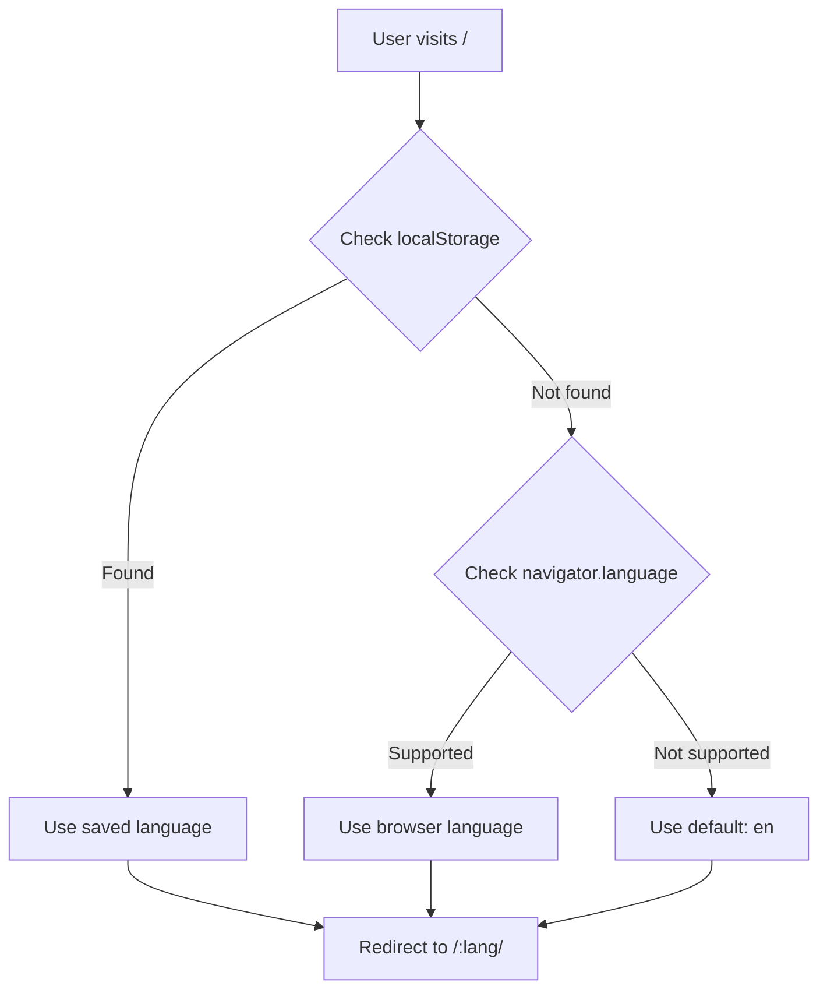
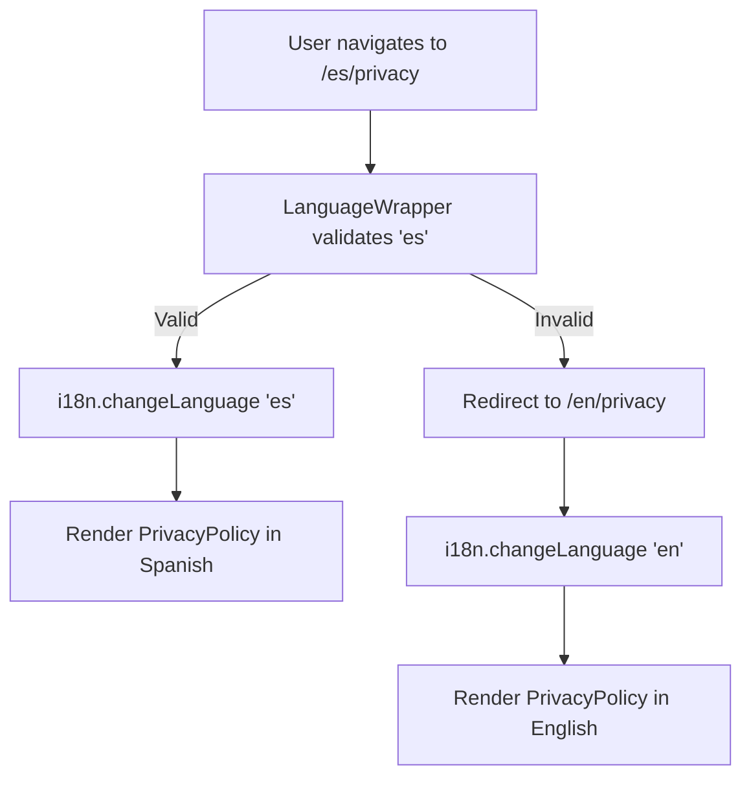

# Internationalized Routing Implementation

## Overview

This document describes the dynamic language slug implementation for SEO-friendly internationalized URLs in the Brand Calculator application.

## Architecture

### URL Structure

The application now uses language-prefixed URLs for better SEO and regional targeting:

```
Before: /         /privacy       /terms        /cookies
After:  /en/      /en/privacy    /en/terms     /en/cookies
        /es/      /es/privacy    /es/terms     /es/cookies
        /fr/      /fr/privacy    /fr/terms     /fr/cookies
        ... (10 supported languages)
```

### Components

#### 1. LanguageRedirect (`src/components/routing/LanguageRedirect.tsx`)

**Purpose**: Handles root path (`/`) redirection to appropriate language version.

**Detection Strategy**:
1. Check `localStorage.preferredLanguage` (user's saved preference)
2. Check `navigator.language` (browser language)
3. Fall back to English (`en`)

**Example Flow**:
```
User visits "/"
  → Browser is set to Spanish
  → Redirects to "/es/"
```

**Key Functions**:
- `detectBrowserLanguage()`: Detects and validates user's preferred language
- `isLanguageSupported()`: Checks if language code is in supported list

#### 2. LanguageWrapper (`src/components/routing/LanguageWrapper.tsx`)

**Purpose**: Wraps all language-prefixed routes and syncs URL with i18next.

**Responsibilities**:
- Validates `:lang` parameter from URL
- Redirects invalid languages to `/en/`
- Syncs URL language with i18next instance
- Renders nested routes via `<Outlet />`

**Example Flow**:
```
User navigates to "/es/privacy"
  → LanguageWrapper validates "es" is supported
  → Calls i18n.changeLanguage('es')
  → Renders PrivacyPolicy component in Spanish
```

#### 3. useLanguageNavigation Hook (`src/hooks/useLanguageNavigation.ts`)

**Purpose**: Provides language-aware navigation utilities for components.

**API**:
```typescript
const {
  navigateTo,        // Navigate to path in current language
  changeLanguage,    // Switch language and reload page
  currentLanguage,   // Get current language from URL
  getPath,          // Get language-prefixed path
} = useLanguageNavigation();
```

**Usage Examples**:

```tsx
// Navigate to privacy page in current language
navigateTo('/privacy');  // /en/ → /en/privacy

// Change language from English to Spanish
changeLanguage('es');    // /en/privacy → /es/privacy

// Get language-aware path for Link component
<Link to={getPath('terms')}>Terms</Link>  // → /en/terms
```

## Routing Configuration

### Route Structure (App.tsx)

```tsx
<Routes>
  {/* Root redirect - detects language */}
  <Route path="/" element={<LanguageRedirect />} />

  {/* Language-prefixed routes */}
  <Route path="/:lang" element={<LanguageWrapper />}>
    {/* Home page */}
    <Route index element={<AppLayout><MainContent /></AppLayout>} />

    {/* Legal pages */}
    <Route path="privacy" element={<PrivacyPolicy />} />
    <Route path="terms" element={<TermsOfService />} />
    <Route path="cookies" element={<CookiePolicy />} />
  </Route>
</Routes>
```

## Updated Components

### Footer Component

**Before**:
```tsx
<Link to="/privacy">Privacy Policy</Link>
```

**After**:
```tsx
const { getPath } = useLanguageNavigation();
<Link to={getPath('privacy')}>Privacy Policy</Link>
```

### Legal Pages (Privacy, Terms, Cookies)

**Before**:
```tsx
<Link to="/" className={styles.backLink}>← Back</Link>
```

**After**:
```tsx
const { getPath } = useLanguageNavigation();
<Link to={getPath('')} className={styles.backLink}>← Back</Link>
```

## Language Detection Flow



## URL Synchronization Flow



## SEO Benefits

### 1. **Unique URLs per Language**
- Google can index each language version separately
- Better regional search rankings
- Clear content targeting

### 2. **hreflang Implementation** (Future Enhancement)
```html
<link rel="alternate" hreflang="en" href="https://example.com/en/privacy" />
<link rel="alternate" hreflang="es" href="https://example.com/es/privacy" />
<link rel="alternate" hreflang="fr" href="https://example.com/fr/privacy" />
```

### 3. **Language-Specific Sitemaps** (Future Enhancement)
```xml
<!-- sitemap-en.xml -->
<url>
  <loc>https://example.com/en/</loc>
  <xhtml:link rel="alternate" hreflang="es" href="https://example.com/es/"/>
</url>
```

### 4. **Better Analytics**
- Track user behavior per language
- Understand regional engagement
- Optimize content per market

## Supported Languages

The application supports 10 European languages:

| Code | Language   | Example URL         |
|------|------------|---------------------|
| `en` | English    | `/en/privacy`       |
| `es` | Spanish    | `/es/privacy`       |
| `fr` | French     | `/fr/privacy`       |
| `de` | German     | `/de/privacy`       |
| `it` | Italian    | `/it/privacy`       |
| `pt` | Portuguese | `/pt/privacy`       |
| `nl` | Dutch      | `/nl/privacy`       |
| `pl` | Polish     | `/pl/privacy`       |
| `sv` | Swedish    | `/sv/privacy`       |
| `el` | Greek      | `/el/privacy`       |

## User Experience

### Scenario 1: First-Time Visitor

1. User visits `https://example.com/`
2. Browser detects Spanish: `navigator.language = 'es-ES'`
3. Redirects to `https://example.com/es/`
4. All navigation preserves Spanish: `/es/privacy`, `/es/terms`

### Scenario 2: Language Switcher

1. User is on `/en/privacy`
2. Clicks language selector → selects "Español"
3. `changeLanguage('es')` is called
4. Navigates to `/es/privacy`
5. Content reloads in Spanish

### Scenario 3: Returning Visitor

1. User previously selected French
2. `localStorage.preferredLanguage = 'fr'`
3. Visits `https://example.com/`
4. Redirects to `https://example.com/fr/`

### Scenario 4: Direct URL Access

1. User receives link: `https://example.com/de/terms`
2. Opens link directly
3. LanguageWrapper validates `de`
4. Sets i18next to German
5. Renders Terms in German

## localStorage Management

The system uses localStorage for persistence:

```typescript
// Language preference
key: 'preferredLanguage'
value: 'en' | 'es' | 'fr' | 'de' | ... (language code)

// Updated by:
// 1. I18nProvider when language changes
// 2. Language selector component
// 3. changeLanguage() function
```

## Edge Cases Handled

### 1. Invalid Language Code
```
URL: /xyz/privacy
Result: Redirects to /en/privacy
```

### 2. Missing Language Preference
```
localStorage: empty
navigator.language: unsupported (e.g., 'ja-JP')
Result: Defaults to /en/
```

### 3. URL Without Language
```
User types: /privacy (old URL format)
Result: No match, shows 404 or can add catch-all redirect
```

## Migration Notes

### Breaking Changes

1. **Old URLs are no longer valid**:
   - `/` → Must redirect to `/:lang/`
   - `/privacy` → Must update to `/:lang/privacy`
   - `/terms` → Must update to `/:lang/terms`
   - `/cookies` → Must update to `/:lang/cookies`

2. **All internal links must use `useLanguageNavigation`**:
   - Replace `<Link to="/privacy">` with `<Link to={getPath('privacy')}>`

### Backward Compatibility (Optional Future Enhancement)

Add catch-all routes for old URLs:

```tsx
<Route path="/privacy" element={<Navigate to="/en/privacy" replace />} />
<Route path="/terms" element={<Navigate to="/en/terms" replace />} />
<Route path="/cookies" element={<Navigate to="/en/cookies" replace />} />
```

## Testing Checklist

- [ ] Root path redirects to detected language
- [ ] Each language URL loads correct translations
- [ ] Footer links preserve current language
- [ ] Legal page back buttons preserve language
- [ ] Invalid language codes redirect to `/en/`
- [ ] Language preference persists in localStorage
- [ ] Browser language detection works
- [ ] Language switcher updates URL correctly
- [ ] Direct URL access works (e.g., `/es/privacy`)
- [ ] Navigation between pages preserves language

## Future Enhancements

1. **Automatic hreflang tags** in `<head>` for SEO
2. **Language switcher component** in header/footer
3. **Sitemap generation** per language
4. **Canonical URL handling** for duplicate content
5. **Server-side rendering** for better SEO
6. **Geolocation-based detection** as additional signal
7. **Language subdomain support** (e.g., `es.example.com`)
8. **RTL support** for Arabic/Hebrew (if added later)

## Related Files

### Created Files
- `/src/components/routing/LanguageRedirect.tsx` - Root redirect logic
- `/src/components/routing/LanguageWrapper.tsx` - Route wrapper
- `/src/hooks/useLanguageNavigation.ts` - Navigation utilities

### Modified Files
- `/src/App.tsx` - Updated routing structure
- `/src/components/Layout/Footer.tsx` - Language-aware links
- `/src/pages/PrivacyPolicy.tsx` - Language-aware navigation
- `/src/pages/TermsOfService.tsx` - Language-aware navigation
- `/src/pages/CookiePolicy.tsx` - Language-aware navigation

### Configuration Files
- `/src/i18n/config.ts` - Language definitions (unchanged)
- `/src/providers/I18nProvider.tsx` - i18next setup (unchanged)

## Performance Considerations

1. **No additional network requests**: Language detection is client-side
2. **Minimal bundle impact**: ~100 lines of new code
3. **No rendering delays**: Language sync is instant
4. **localStorage is fast**: Preference retrieval is synchronous
5. **React Router optimization**: Uses `replace: true` to avoid history bloat

## Accessibility

- All routes maintain proper `<title>` tags
- Screen readers announce language changes
- Keyboard navigation preserved
- ARIA labels maintained in all languages
- Focus management unaffected

## Browser Support

- Modern browsers: Full support
- IE11: Requires polyfill for `navigator.language`
- Safari: Full support
- Mobile browsers: Full support

## Summary

This implementation provides:
- SEO-friendly language-specific URLs
- Automatic language detection
- Seamless language switching
- Persistent language preferences
- Clean, maintainable code architecture
- Better regional search rankings
- Enhanced user experience

All navigation now preserves language context, and the system gracefully handles edge cases while providing a solid foundation for international growth.
